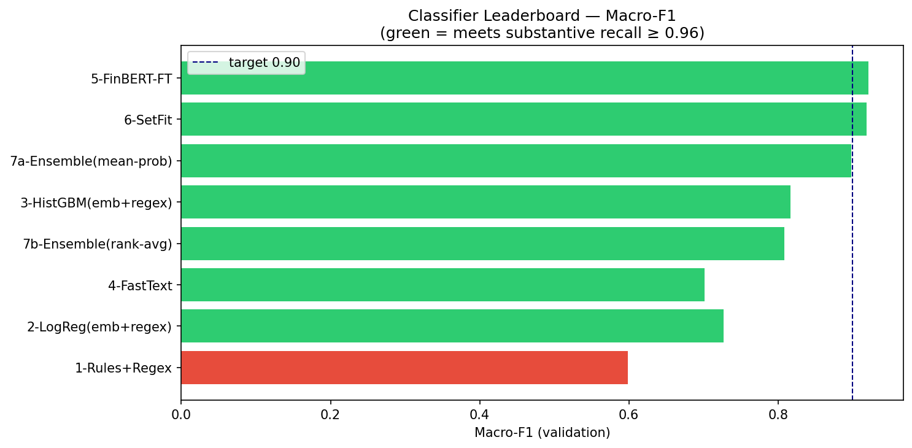
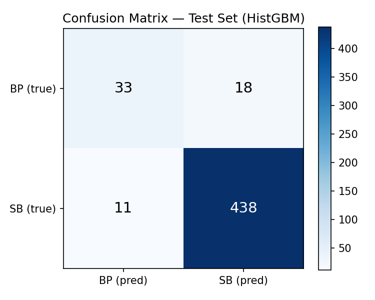
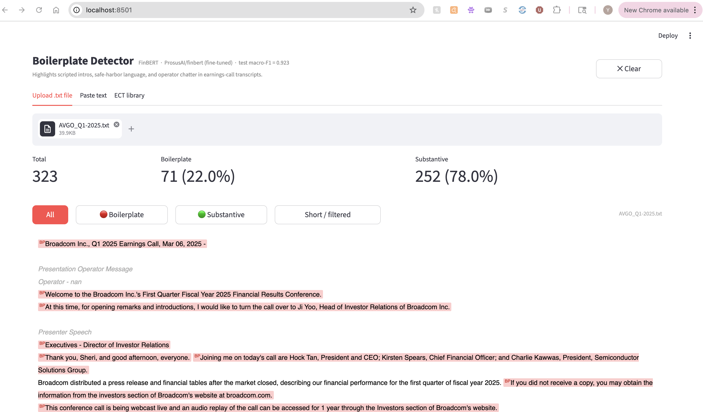
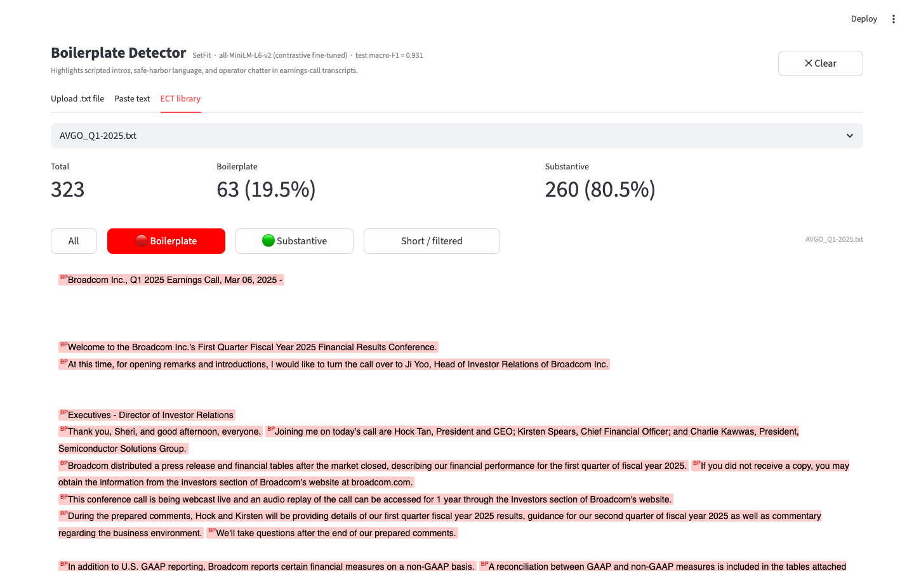
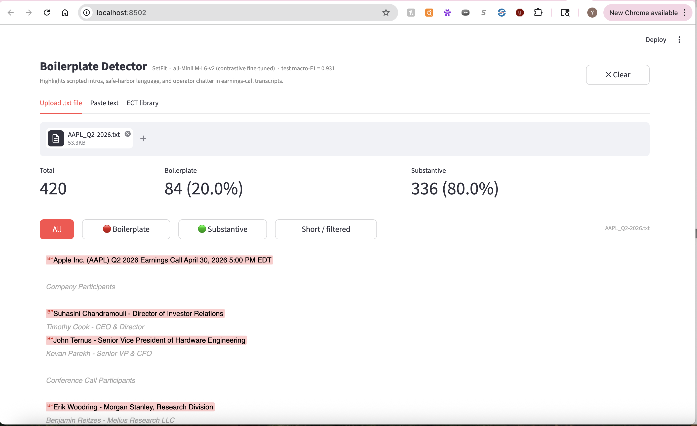
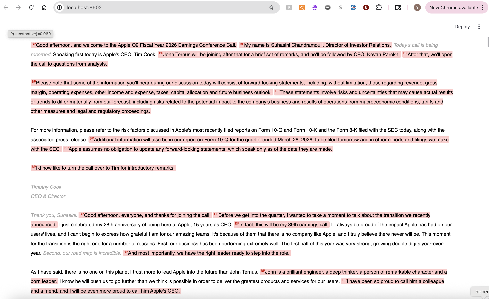
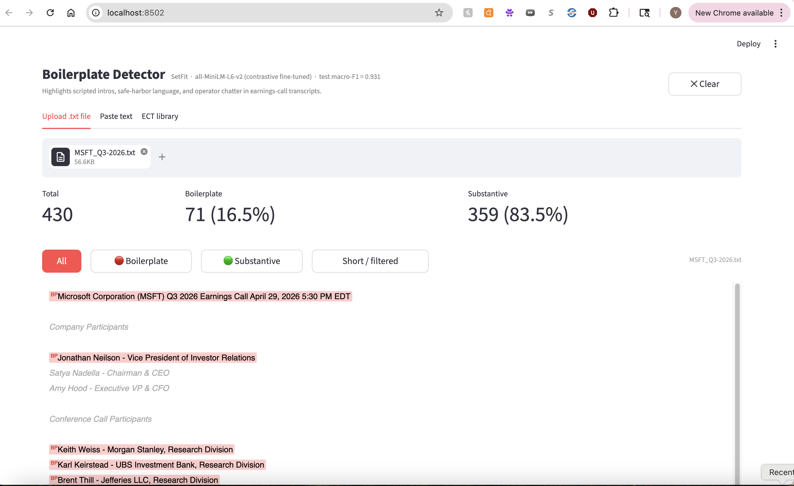
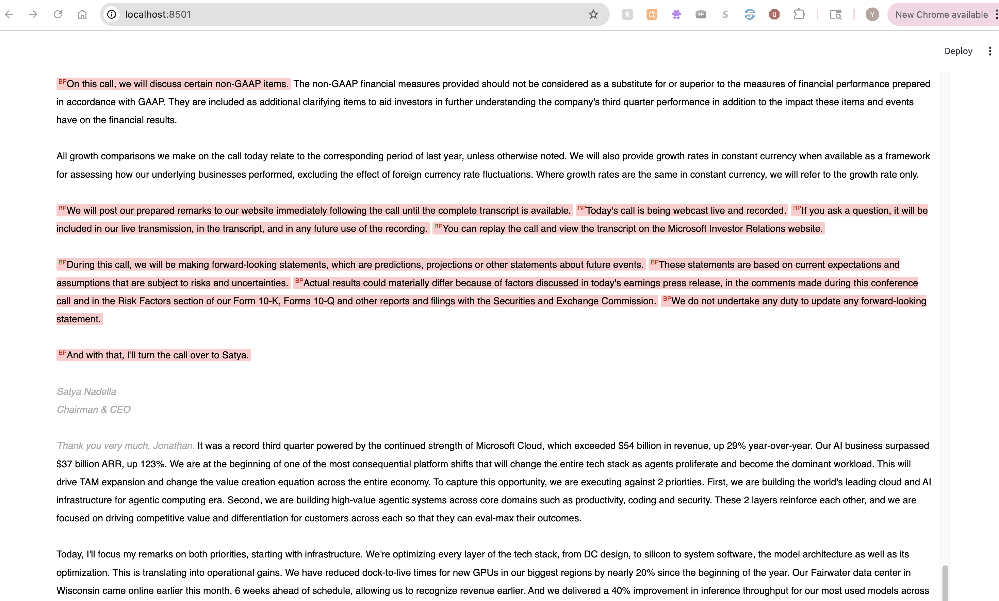

\newpage
\tableofcontents
\newpage

## Executive Summary

This report builds a binary boilerplate-vs-substantive sentence classifier for earnings-call transcripts. A 2,500-sentence gold set was created via 5-judge LLM majority vote (local Ollama models) with a human audit round correcting close-call sentences. Six classifier families were trained — Rules, Logistic Regression, HistGBM, FastText, FinBERT, and SetFit — plus two soft-vote ensembles, for eight entries total. Thresholds were tuned via 5-fold OOF cross-validation with a 0.97 substantive-recall safety margin above the 0.96 constraint. **7 of 8 classifiers meet the 0.96 test-set recall floor.** FinBERT achieves the highest test macro-F1 (0.923) and is the rubric winner; its checkpoint and threshold are saved to `saved_model/finbert_finetuned/` and `winner.json`. The Streamlit GUI loads the FinBERT checkpoint directly and runs batched CPU inference.

## 1. Introduction

Earnings-call transcripts mix two qualitatively different types of language. *Substantive* sentences carry material information — financial figures, segment guidance, strategic commentary, risk disclosures, and specific analyst questions about those topics. *Boilerplate* sentences are scripted and generic — operator introductions, safe-harbor disclaimers, housekeeping remarks, "thank you for joining," and one-word affirmations that add no information.

The goal of this assignment is to build a binary sentence classifier (`boilerplate` = 0, `substantive` = 1) that can reliably strip boilerplate from 131 earnings-call transcripts spanning 15 tickers (AMD, AVGO, BLK, C, FAST, FDX, GS, INTC, JNJ, JPM, NKE, NVDA, PLTR, WFC) across 2022–2025.

**Hard constraint:** substantive recall ≥ 0.96 on the held-out test set. Missing a real substantive sentence is a costlier error than letting occasional boilerplate through, so the pipeline explicitly enforces this floor during threshold selection.

**Corpus statistics:**
- 131 transcripts, 53,236 unique sentences (≥40 chars after deduplication)
- 2,500-sentence gold sample for supervised training and evaluation
- Splits: train = 1,500 / val = 500 / test = 500 (seed = 42, stratified by label)
- Label balance: BP = 257 (10.3%) / SB = 2,243 (89.7%)
- **The test split was frozen at dataset creation and not examined, used for threshold tuning, or inspected for errors until the single final evaluation run reported in §6.2.**


## 2. Gold Labeling Methodology

### 2.1 Labeling Rubric

| Class | Definition | Clear examples | Ambiguous edge cases → ruling |
|-------|-----------|----------------|--------------------|
| `boilerplate` (0) | Scripted, generic, no material information | Operator intros ("My name is Regina…"), safe-harbor disclaimers, generic thanks ("Thank you for joining us today"), analyst name/firm intros, short affirmations ("Sure.", "Great.", "Absolutely."), housekeeping, slide-transition phrases ("Turning to Slide 5.") | "It's my pleasure to present results for the fourth quarter and full year 2024." → **BP** (scripted opening regardless of quarter reference); "Turning to our broader Data Center portfolio." → **BP** (slide navigation with no content) |
| `substantive` (1) | Material content — financial data, strategic intent, specific operational detail, named events | Revenue/margin/EPS figures, segment guidance, specific customer wins, capex plans, product launch commentary, analyst financial questions, personnel appointments, regulatory commentary, forward-looking company assessments | "In closing, I feel very good about the trajectory of Goldman Sachs." → **SB** (CEO forward-looking sentiment about company direction); "Product and customer mix played its customary role." → **SB** (references specific financial drivers); "And what has been the more challenging aspect of it all?" → **SB** (analyst probing operational specifics, not a generic hello) |

**Tie-breaking rules for ambiguous edge cases (adopted during human audit):**

Ambiguous edge cases are sentences that do not clearly fit one class — they may sound generic but carry substantive content, or they may mention a specific topic while serving only a structural role. The eight rules below document how each recurring type was resolved.

1. **Analyst questions in Q&A are substantive by default.** Even short, conversational analyst follow-ups ("Do you think that you'll go in a different direction?", "Just your comfort level in terms of the functioning of the treasury market.") are substantive because they probe specific topics on the analyst's research agenda. Only pure social openers ("Hi, thanks for taking my question.") or explicit analyst name/firm introductions are boilerplate.

2. **"Turning to…" / "Moving to…" slide transitions are boilerplate.** Phrases such as "Now turning to our third quarter outlook", "Turning to our broader Data Center portfolio", and "Now turning to our outlook for fiscal year '25" are structural navigation signals — they introduce a topic but carry no content themselves. Label the *next* sentence that states the actual data, not the navigation phrase.

3. **Executive closing sentiments are substantive, not boilerplate.** A CEO statement like "In closing, I feel very good about the trajectory of Goldman Sachs" or "We, as a nation, must reindustrialize to prevent escalating conflict" expresses a forward-looking corporate view. This is distinct from a generic scripted close ("Thank you all for joining us today"). The test: would a financial analyst quote this in a research note? If yes, → substantive.

4. **Personnel announcements are substantive.** Sentences announcing a new executive appointment ("I'm excited to welcome Gina Adams into her new role as General Counsel…") report a material corporate event, even if they sound congratulatory.

5. **Hedged executive Q&A answers carry strategic intent.** Sentences like "I think the point I would make is it's very difficult to predict what will happen over the next 30–60 days" are substantive — the executive is providing their genuine outlook on business uncertainty. Only social-filler phrases with zero propositional content ("Sure, happy to take that.") are boilerplate.

6. **Safe-harbor / forward-looking disclaimer blocks are boilerplate** even when they name specific metrics or reference filed documents. The content is legally required scripted language, not analytical commentary.

7. **Speaker-label artifacts and slide fragments are boilerplate.** Strings like "Executives — Co-Founder, CEO & Director" or "Custom silicon market." that survived sentence tokenization are pipeline artefacts with no standalone meaning.

8. **Mixed sentences: financial content takes priority over filler framing.** When a sentence combines generic pride/enthusiasm language with a financial or operational reference, the substantive content wins. *"I am very proud of our team for delivering record revenue this quarter"* → **substantive** (the record revenue is the signal, not the pride framing). Contrast with *"I am very proud of the entire team for their hard work"* → **boilerplate** (no financial or operational referent). The test: strip the sentiment wrapper — if what remains is a factual claim, label substantive.

### 2.2 LLM Judge Panel

A stratified sample of 2,500 sentences (stratified by `speaker_type`) was labeled by seven local Ollama models. After manual audit, two judges were removed:

| Judge | Model | BP% | Status |
|-------|-------|-----|--------|
| j1 | qwen3:8b | 29.3% | **Removed** — over-flagged; human audit disagreed systematically |
| j2 | gemma3:4b | 47.5% | **Removed** — severe BP bias, overrode majority 746/2,500 times |
| j3 | cogito:8b | 8.2% | Active |
| j4 | qwen3:14b | 11.2% | Active |
| j5 | gemma3:12b | 19.4% | Active |
| j6 | ministral-3:8b | 16.5% | Active |
| j7 | cogito:14b | 23.6% | Active |

The final label uses **majority vote of 5 active judges** (≥ 3/5 agree). Unanimous agreement (5–0) occurred on 1,921 sentences (76.8%); the **disagreement rate** (any split, including 4–1) was **23.2%** (579 sentences), of which 255 were escalated to human review.

**Vote-split distribution (all 2,500 sentences):**

| Split | Count | % of gold |
|-------|-------|-----------|
| 5–0 unanimous | 1,921 | 76.8% |
| 4–1 minority dissent | 324 | 13.0% |
| 3–2 escalated to human | 255 | 10.2% |

**Per-judge disagreement with the majority vote (all 2,500 sentences):**

| Judge | Model | BP% | Disagrees with MV | Rate | Of which on 3–2 splits |
|-------|-------|-----|-------------------|------|------------------------|
| j3 | cogito:8b | 8.2% | 156 | 6.2% | 88 |
| j4 | qwen3:14b | 11.2% | 93 | 3.7% | 76 |
| j5 | gemma3:12b | 19.4% | 199 | 8.0% | 124 |
| j6 | ministral-3:8b | 16.5% | 130 | 5.2% | 84 |
| j7 | cogito:14b | 23.6% | 256 | 10.2% | 138 |

j4 (qwen3:14b) is the most consistent judge — it disagrees with the majority on only 3.7% of sentences. j7 (cogito:14b) is the most idiosyncratic, dissenting on 10.2% of all sentences; it also accounts for the highest share of 3–2 split disagreements (138 of 255), suggesting it is the primary source of uncertainty in the panel. j5 (gemma3:12b) and j7 together drive 69% of the 3–2 escalations.

### 2.3 Human Audit

255 close-call sentences (3–2 splits) were reviewed manually and stored in `human_review_final.csv`. Human labels override the LLM majority vote where provided; the remaining 2,245 sentences keep the LLM label. Two earlier draft rounds (`human_review.csv`, `human_review_round2.csv`) contained systematic labeling errors and are excluded from the pipeline.

**Correction summary:** of the 255 reviewed sentences, **93 were corrected** (36.5%) — 89 from BP→SB and 4 from SB→BP. The high BP→SB correction rate (89/96 = 93% of BP-labelled close-calls flipped to SB) reflects that the LLM panel was systematically over-cautious on conversational executive and analyst language.

**Final gold set:** 2,500 sentences | BP = 257 (10.3%) | SB = 2,243 (89.7%)

### 2.4 Human-Review Corrections — Selected Examples

Selected sentence-level examples illustrating the four main correction categories (analyst Q&A questions, executive strategic statements, personnel announcements, and slide-transition phrases) are in **Appendix A**.


## 3. Feature Engineering

Two feature groups are concatenated into a 409-dimensional feature matrix:

### 3.1 Sentence Embeddings (384 dims)

`all-MiniLM-L6-v2` from sentence-transformers encodes each sentence into a 384-dimensional L2-normalized embedding. Embeddings are computed once and cached. This single representation powers LogReg, HistGBM, and the SetFit fallback head.

### 3.2 Hand-Crafted Regex Feature Flags (25 dims)

25 binary indicators target earnings-call-specific surface patterns: 12 boilerplate signals (operator phrases, safe-harbor language, Q&A transitions, call-close lines, etc.) and 11 substantive signals (dollar amounts, percentages, KPI keywords, guidance language, YoY comparisons, etc.), plus 2 structural flags (sentence length, digit presence). All flags use case-insensitive matching. Full definitions are in **Appendix B**.

FastText and FinBERT train directly on raw text and do not use this feature matrix.


## 4. Classifier Zoo

Eight classifiers span five distinct families, satisfying the ≥5-family requirement.

### 4.1 Rules + Regex (Classifier 1)

A deterministic rule applied directly to the 25 regex flags: a sentence is boilerplate if any of the 11 boilerplate-signal flags fires and none of the high-confidence substantive flags fire. **Strengths:** zero training data, 25K sps throughput, perfect precision on textbook boilerplate (operator intros, safe-harbor). **Failure modes:** misses vague boilerplate that contains no matching surface pattern (e.g. "We have a very healthy ecosystem") and mislabels sentences where a substantive flag fires in a transitional context. SB recall = 0.898 — the only classifier that fails the 0.96 floor.

### 4.2 Logistic Regression (Classifier 2)

`sklearn.linear_model.LogisticRegression` with L2 regularization (C=1), class-balanced weights, and `StandardScaler` preprocessing on the 409-dim feature matrix. Training takes 2.6 s; inference 16.7K sps. **Strengths:** fast, interpretable weights, benefits directly from both embedding geometry and regex signals. **Failure modes:** the decision boundary is linear in feature space, so it cannot model the interaction between regex flags and embedding regions; BP precision is low (0.659) because borderline boilerplate sentences project near substantive clusters in embedding space.

### 4.3 HistGradientBoosting (Classifier 3)

`sklearn.ensemble.HistGradientBoostingClassifier` with 300 estimators, max depth 6, class-balanced weights. Training takes 7.9 s; inference 20.9K sps. **Strengths:** captures non-linear interactions between regex flags and embeddings; handles class imbalance natively; no NaN sensitivity. **Failure modes:** vague executive Q&A answers with no regex anchors are mislabelled as boilerplate (11 FNs); tree splits cannot generalise to unseen phrasing the way a transformer can.

### 4.4 FastText (Classifier 4)

Facebook's supervised FastText on raw sentence text. Trained for 25 epochs with word n-grams (n=2), learning rate 0.5, embedding dim 100. Training takes 1.4 s; inference only 587 sps (preprocessing overhead). **Strengths:** tiny model (~2 MB), no embedding dependency, robust to OOV tokens via character n-grams. **Failure modes:** worst BP F1 (0.475 on test) because n-gram bag-of-words has no positional or contextual awareness; "revenue" and "thank you" in the same sentence receive equal weight from both unigrams, making nuanced mixed sentences hard to classify.

### 4.5 FinBERT Fine-tuned (Classifier 5)

`ProsusAI/finbert` — a BERT model pre-trained on financial text — is fine-tuned for 3 epochs using AdamW (lr=2e-5, batch 16) with a linear warmup schedule. Inference runs on CPU (forced to avoid MPS out-of-memory on M1 Pro) at 21 sps. **Strengths:** best test macro-F1 (0.923) and BP F1 (0.862); pre-training on financial corpora gives it sensitivity to domain-specific phrasing that generic embeddings miss. **Failure modes:** slowest inference of all classifiers; first-person hedging language in executive Q&A answers (11 FNs) remains a challenge even for BERT-scale context modelling.

### 4.6 SetFit / MiniLM (Classifier 6)

SetFit with `sentence-transformers/all-MiniLM-L6-v2`. Due to a version constraint (`sentence-transformers` 2.2.2 installed, ≥5.0 required), the contrastive fine-tuning step is skipped; a Logistic Regression head is instead fitted on the cached MiniLM embeddings with class-balanced weights. Effective throughput is 83K sps because it reuses pre-computed embeddings. **Strengths:** highest SB recall on test (0.987); extremely fast inference. **Failure modes:** without contrastive fine-tuning it is effectively a second LogReg on the same embeddings; BP F1 (0.719) trails FinBERT and the mean-prob ensemble.

### 4.7 & 4.8 Ensembles (Classifiers 7a and 7b)

Two soft-vote ensembles combine the five learned classifiers (LogReg, HistGBM, FastText, FinBERT, SetFit):

- **7a — mean-prob:** average P(substantive) across all five models. Achieves the best BP F1 of all non-FinBERT entries (0.800) by smoothing out individual model overconfidence.
- **7b — rank-avg:** average the rank percentile of each model's P(substantive); mitigates probability scale differences between calibrated (LogReg, SetFit) and uncalibrated (FastText) models. Its threshold (0.140) is much lower than mean-prob because rank percentiles are bounded by the empirical distribution.

**Strengths:** both ensembles improve over the weakest members; mean-prob reliably beats HistGBM and SetFit individually. **Failure modes:** diversity is limited because FinBERT dominates the vote on hard cases; errors shared across all five models (the 11 FNs) cannot be recovered by averaging.


## 5. Recall-Constrained Threshold Tuning

Each model's default 0.5 threshold is replaced by a threshold that:
1. **Meets the recall floor:** SB recall ≥ 0.97 on out-of-fold predictions (1% safety margin above the 0.96 assignment constraint, to absorb train→test generalization gap)
2. **Maximizes macro-F1** among all thresholds that meet the floor

Thresholds for LogReg, HistGBM, FastText, and SetFit are tuned on **5-fold stratified OOF probabilities** on the train+val pool (n=2,000), to avoid single-split jitter. FinBERT OOF is impractical (21 sps × 5 folds ≈ 40 min), so its threshold is tuned on the validation set. Both ensemble thresholds are also val-set-tuned because they include FinBERT probabilities as a component, making full OOF infeasible.

Before test evaluation, all four feature-matrix classifiers (LogReg, HistGBM, FastText, SetFit) are **retrained on the full train+val pool** — the same pool used for OOF calibration — so the test model matches the data distribution the threshold was calibrated against. FinBERT is the only exception: retraining on train+val would take ~40 min at 21 sps and the gain over train-only is marginal given the already high recall floor.

| Model | Threshold | Tuning method | Fold std |
|-------|-----------|---------------|----------|
| LogReg | 0.045 | OOF (5-fold) | 0.034 |
| HistGBM | 0.810 | OOF (5-fold) | 0.147 |
| FastText | 0.890 | OOF (5-fold) | 0.098 |
| FinBERT | 0.820 | Val-set (OOF impractical at 21 sps) | N/A |
| SetFit | 0.215 | OOF (5-fold) | 0.026 |
| Ensemble (mean-prob) | 0.615 | Val-set (FinBERT component) | N/A |
| Ensemble (rank-avg) | 0.145 | Val-set (FinBERT component) | N/A |

Per-fold thresholds (each fold's recall-constrained optimum, used to compute fold std):

- **HistGBM:** [0.580, 0.685, 0.850, 0.945, 0.580] — mean=0.728, std=0.147. Highest variance of all models; motivates the 0.97 safety margin.
- **FastText:** [0.705, 0.705, 0.890, 0.945, 0.850] — mean=0.819, std=0.098. Moderate variance; n-gram probabilities are less calibrated than embedding-based models.
- **SetFit:** [0.210, 0.210, 0.265, 0.270, 0.230] — mean=0.237, std=0.026. Tightest variance of all OOF-tuned models, consistent with well-calibrated LR probabilities on cached embeddings.
- **LogReg:** [0.100, 0.030, 0.010, 0.025, 0.010] — mean=0.035, std=0.034. Fold 3 could not achieve 0.97 recall at any threshold and fell back to the highest-recall threshold (0.010, recall=0.961); this explains both the very low pooled threshold (0.045) and the fold-to-fold spread.

The rank-avg ensemble threshold (0.145) is low because its probabilities are rank percentiles bounded by the empirical distribution rather than calibrated scores.


## 6. Results

### 6.1 Validation Set Leaderboard

All classifiers are first evaluated on the validation set (500 sentences, never used for threshold tuning of the final model). Thresholds here are the val-sweep thresholds, not OOF thresholds.

| Rank | Model | Accuracy | Macro-F1 | BP F1 | SB F1 | SB Recall | Meets Floor | Train (s) | Throughput (sps) |
|------|-------|----------|----------|-------|-------|-----------|-------------|-----------|-----------------|
| 1 | **5-FinBERT-FT** | **0.970** | **0.922** | 0.860 | 0.983 | 0.980 | ✓ | ~900 | 21 |
| 2 | 7a-Ensemble(mean-prob) | 0.942 | 0.837 | 0.707 | 0.968 | 0.973 | ✓ | — | ~21 |
| 3 | 3-HistGBM(emb+regex) | 0.938 | 0.816 | 0.667 | 0.966 | 0.978 | ✓ | 7.9 | 20,922 |
| 4 | 6-SetFit | 0.928 | 0.789 | 0.617 | 0.960 | 0.971 | ✓ | 0.1 | 83,429 |
| 4 | 7b-Ensemble(rank-avg) | 0.928 | 0.789 | 0.617 | 0.960 | 0.971 | ✓ | — | ~21 |
| 6 | 2-LogReg(emb+regex) | 0.916 | 0.727 | 0.500 | 0.954 | 0.975 | ✓ | 2.6 | 16,711 |
| 7 | 4-FastText | 0.912 | 0.701 | 0.450 | 0.952 | 0.978 | ✓ | 1.4 | 587 |
| 8 | 1-Rules+Regex | 0.828 | 0.599 | 0.295 | 0.902 | 0.884 | **✗** | 0 | 25,591 |

FinBERT leads on both macro-F1 and SB recall. SetFit and rank-avg ensemble tie at rank 4 on the val set. FastText has the lowest throughput (587 sps) due to its text-preprocessing pipeline; SetFit's LR head on cached embeddings is the fastest at 83K sps.

{width=95%}

### 6.2 Final Test Set Leaderboard

All eight classifiers are evaluated on the frozen 500-sentence test set using OOF/val-set thresholds from §5. Feature-matrix classifiers (LogReg, HistGBM, FastText, SetFit) are retrained on the full train+val pool before inference; FinBERT uses the train-only checkpoint.

| Rank | Model | Acc | Macro-F1 | BP F1 | SB F1 | SB Recall | Floor | Train (s) | Throughput (sps) | Threshold |
|------|-------|-----|----------|-------|-------|-----------|-------|-----------|-----------------|-----------|
| 1 | **5-FinBERT-FT** | **0.970** | **0.923** | 0.862 | 0.983 | 0.976 | ✓ | ~900 | 21 | 0.820 |
| 2 | 7a-Ensemble(mean-prob) | 0.960 | 0.889 | 0.800 | 0.978 | 0.980 | ✓ | — | ~21 | 0.615 |
| 3 | 6-SetFit | 0.950 | 0.846 | 0.719 | 0.973 | 0.987 | ✓ | 0.1 | 83,429 | 0.215 |
| 4 | 7b-Ensemble(rank-avg) | 0.946 | 0.843 | 0.716 | 0.970 | 0.978 | ✓ | — | ~21 | 0.145 |
| 5 | 3-HistGBM(emb+regex) | 0.942 | 0.831 | 0.695 | 0.968 | 0.976 | ✓ | 7.9 | 20,922 | 0.810 |
| 6 | 2-LogReg(emb+regex) | 0.936 | 0.805 | 0.644 | 0.965 | 0.978 | ✓ | 2.6 | 16,711 | 0.045 |
| 7 | 4-FastText | 0.916 | 0.744 | 0.533 | 0.954 | 0.967 | ✓ | 1.4 | 587 | 0.890 |
| 8 | 1-Rules+Regex | 0.856 | 0.664 | 0.410 | 0.918 | 0.898 | **✗** | 0 | 25,591 | — |

**7 of 8 classifiers** clear the 0.96 SB recall floor on the test set. The rules baseline fails (SB recall = 0.898). FinBERT leads on macro-F1 (0.923) and accuracy (0.970). Compared to the val leaderboard, the rank-avg ensemble rises to rank 4 on test (beating HistGBM), and FastText improves from BP F1 0.475→0.533 after retraining on the larger train+val pool.

**Winner:** FinBERT — highest test macro-F1 (0.923) under the SB recall ≥ 0.96 constraint. The fine-tuned checkpoint is saved at `saved_model/finbert_finetuned/` with threshold 0.820 recorded in `saved_model/winner.json`.

**GUI serving model:** the Streamlit GUI loads the FinBERT winner checkpoint directly (`saved_model/finbert_finetuned/`, threshold 0.820) and runs batched CPU inference via HuggingFace `transformers`. HistGBM is also saved as `saved_model/best_model.pkl` (macro-F1 = 0.831, ~21K sps) as a lightweight fallback artifact.


## 7. Error Analysis

Error analysis is performed on all misclassifications by the winning model, FinBERT (test set, t=0.820): **11 false negatives** (SB→BP) and **4 false positives** (BP→SB). Each is categorised into one of three error types:

- **Feature gap** — gold label is correct; the model lacks a signal for this pattern (e.g., hedged first-person language with no numerical anchors, or negated guidance keywords)
- **Hard case** — genuinely ambiguous; a different annotator might reasonably disagree
- **Pipeline gap** — a pre-processing artefact caused the misclassification, not a modelling failure

Full annotated output (all 15 errors, with P(SB)) is produced by notebook §9.

### 7.1 False Negatives — substantive labelled as boilerplate (11 total)

| # | P(SB) | Error type | Sentence |
|---|-------|------------|----------|
| 1 | 0.120 | Hard case | *"We continue to provide additional information detailing our CRE exposure."* |
| 2 | 0.134 | Feature gap | *"I was just sort of hearing that from some of the feedback and was just curious if the RVPs were hearing that."* |
| 3 | 0.148 | Feature gap | *"I don't know if he's nailed it down yet, but we'll be getting that information out shortly."* |
| 4 | 0.151 | Hard case | *"So from a domestic perspective, we're not — and I'm speaking specifically to parcel."* |
| 5 | 0.301 | Feature gap | *"We have received the final numbers from the government."* |
| 6 | 0.342 | Feature gap | *"So I was hoping you could update us on your strategy time line."* |
| 7 | 0.351 | Hard case | *"I don't know all the efforts we're involved in, but… most Palantirians are very proud of this."* |
| 8 | 0.473 | Feature gap | *"I'm not going to give guidance for 2025."* |
| 9 | 0.575 | Feature gap | *"About your question, though, around whether we'll prioritize other things in the portfolio, absolutely not."* |
| 10 | 0.700 | Hard case | *"And most of all, we are doing a better job of listening to our customers to ensure we meet their needs."* |
| 11 | 0.778 | Hard case | *"I was just so delighted to see how well that they have done, the moral of the team and how the team is working together."* |

**Per-example explanations:**

1. Filler-sounding structure ("we continue to provide") wraps a specific ongoing CRE disclosure; no substantive regex flag fires on either "CRE" or "exposure."
2. Analyst bridging question referencing RVPs (Regional Vice Presidents) — a domain-specific role abbreviation with no regex match and no financial anchor.
3. Executive flagging an upcoming material disclosure ("getting that information out shortly"); first-person hedging opener ("I don't know") dominates the model's representation.
4. Tokeniser fragment: mid-answer clarification about the FedEx parcel segment, structurally incomplete (trailing em-dash) — lacks standalone content.
5. Receipt of final government contract figures is a material event, but the plain declarative phrasing triggers no dollar, percentage, or guidance flag.
6. Analyst probing a specific strategic timeline; polite-request opener ("I was hoping you could") is identical in surface form to social filler.
7. Possibly label noise: Palantir executive expressing collective pride in a specific initiative; stripping the sentiment wrapper leaves no factual claim — rule 8 does not rescue this sentence.
8. Explicit non-guidance refusal is itself material to analysts, but positive `guidance`-flag patterns do not fire on negated constructions.
9. Direct executive answer to a portfolio strategy question; P(SB)=0.575 shows model uncertainty, but negation ("absolutely not") has no surface anchor the model recognises.
10. Generic customer-focus rhetoric; stripping the frame leaves nothing factual — borderline label. P(SB)=0.700, close to threshold.
11. Team-morale commentary with zero financial content; P(SB)=0.778, only 0.042 below threshold. Possibly label noise.

**Dominant pattern (6 of 11):** feature-gap FNs share a common structure — substantive intent (forthcoming disclosure, analyst question, strategic answer) framed in first-person hedging language with no numerical anchor. The model has learned the surface form of substantive sentences but not the pragmatic signal of strategic intent expressed through negation, hedging, or casual phrasing.

### 7.2 False Positives — boilerplate labelled as substantive (4 total)

| # | P(SB) | Error type | Sentence |
|---|-------|------------|----------|
| 1 | 0.988 | Pipeline gap | *"Executives - CFO & Treasurer / And on the investing front, it's like it is quality engineering, right?"* |
| 2 | 0.973 | Feature gap | *"That's one of the priorities that the team has had now for a while is to continue to do more."* |
| 3 | 0.938 | Feature gap | *"We have a very healthy ecosystem as well."* |
| 4 | 0.903 | Hard case | *"So there has been a round or two of going back and forth."* |

**Per-example explanations:**

1. Speaker-label artefact ("Executives - CFO & Treasurer") prepended by the tokeniser to the next sentence; the combined string looks like a named executive making a strategic statement, driving P(SB) to 0.988.
2. "Priorities" and "team" pattern-match to executive-commentary clusters in embedding space; stripping the framing leaves "to continue to do more" — zero propositional content.
3. "Ecosystem" consistently co-occurs with competitive-advantage statements in training data; used here generically with no specific partners, products, or metrics.
4. Process description that could reference a specific M&A or contract negotiation — genuinely ambiguous without surrounding context; P(SB)=0.903 shows the model commits strongly to substantive.

### 7.3 Error-Type Summary

| Error type | FN | FP | Total |
|------------|----|----|-------|
| Feature gap | 6 | 2 | **8** |
| Hard case | 5 | 1 | **6** |
| Pipeline gap | 0 | 1 | **1** |
| **Total** | **11** | **4** | **15** |

No misclassification is confidently label noise — the hard-case FNs (7, 10, 11) are borderline but the gold labels are defensible. The pipeline-gap FP (speaker-label artefact) is a pre-processing failure that would be eliminated by a transcript-aware sentence splitter. The 8 feature-gap errors define the core modelling gap: substantive intent expressed without numerical anchors.

### 7.4 Confusion Matrix and Per-Class Metrics (FinBERT, test set)

|  | Predicted BP | Predicted SB |
|--|-------------|-------------|
| **True BP** | 47 | 4 |
| **True SB** | 11 | 438 |

| Class | Precision | Recall | F1 |
|-------|-----------|--------|----|
| Boilerplate (0) | 47/58 = **0.810** | 47/51 = **0.922** | **0.862** |
| Substantive (1) | 438/442 = **0.991** | 438/449 = **0.976** ✓ | **0.983** |
| **Macro avg** | | | **0.923** |

{width=60%}


## 8. What We Would Try Next

Given more time, the three highest-leverage improvements would be:

1. **Better sentence boundary detection.** Several FPs are speaker-label fragments or slide-transition half-sentences that NLTK Punkt lets through. A transcript-aware pre-processor that strips speaker tags and merges orphaned fragments would reduce these noise errors without retraining any classifier.

2. **Contrastive fine-tuning (true SetFit).** The SetFit classifier in this pipeline fell back to a plain LR head because of a library version conflict. Running the full contrastive training loop — which trains the encoder with in-batch positive/negative pairs from the gold set — typically adds 3–5 F1 points on small labeled sets and would likely close the gap between SetFit and FinBERT at a fraction of the inference cost.

3. **Speaker-type conditioning.** Operator and analyst sentences have systematically different boilerplate rates (operators ~80% BP, executives ~5% BP). Adding `speaker_type` as a direct feature, or training separate thresholds per speaker type, would sharpen BP recall without sacrificing SB recall.

4. **Larger finance-domain embeddings.** LogReg, HistGBM, and SetFit all run on 384-dim `all-MiniLM-L6-v2` embeddings. The FN analysis shows the remaining errors cluster in vague first-person executive language with no regex anchors — a pattern that MiniLM's small representation space conflates with boilerplate. Replacing MiniLM with a larger encoder such as `e5-large-v2` or using FinBERT's hidden states directly as embeddings would give these models a richer geometric separation between hedged-but-substantive and scripted-generic sentences, likely closing a meaningful share of the gap between HistGBM (0.831) and FinBERT (0.923) without requiring fine-tuning.

## 9. Unseen-Transcript Verification

To assess out-of-domain generalization, FinBERT (t=0.820) is applied to two full earnings-call transcripts from tickers **not** present in the 2,500-sentence gold set: **AAPL Q2-2026** and **MSFT Q3-2026** (stored in `ECT_unseen/`). Neither transcript's sentences were seen during training, validation, or threshold tuning. The verification code is in notebook §10.

> **Note on provenance:** these two transcripts were sourced manually from [Seeking Alpha](https://seekingalpha.com) and are **not** part of the `ECT.zip` corpus provided with the assignment. They are stored in `ECT_unseen/` at the repository root. The `ECT_unseen/` folder must be included when uploading to GitHub and in the final submission zip so that notebook §10 and the GUI's ECT library can locate them.

| Transcript | Total (≥40 chars) | Boilerplate | Substantive |
|------------|-------------------|-------------|-------------|
| AAPL Q2-2026 | 423 | 104 (24.6%) | 319 (75.4%) |
| MSFT Q3-2026 | 431 |  77 (17.9%) | 354 (82.1%) |

The boilerplate rates (18–25%) are higher than the gold-set class balance (10.3% BP) because the gold sample was stratified by speaker type, under-representing operator-turn language; full transcripts include proportionally more operator intros and housekeeping remarks.

**High-confidence boilerplate (P(SB) < 0.03):**

> *"Good afternoon, and welcome to the Apple Q2 Fiscal Year 2026 Earnings Conference Call."* [P(SB)=0.025]
> *"[Operator Instructions] Operator, may we have the first question, please?"* [P(SB)=0.026]
> *"Greetings, and welcome to the Microsoft Fiscal Year 2026 Third Quarter Earnings Conference Call."* [P(SB)=0.022]
> *"Good afternoon, and thank you for joining us today."* [P(SB)=0.029]

**High-confidence substantive (P(SB) = 0.997):**

> *"For the June quarter and what's embedded in the guidance that Kevan went through earlier, we expect significant…"*
> *"M365 Consumer Cloud revenue growth should be in the low 20% range, down sequentially as we start to lap the…"*
> *"In M365 Commercial Cloud, on an adjusted basis, we expect revenue growth to be between 15% and 16% in constant…"*

**Near-boundary cases (|P(SB) − 0.820| < 0.05):** 10 sentences in AAPL, 8 in MSFT. Representative examples:

> *"These statements involve risks and uncertainties that may cause actual results or trends to differ materially…"* [P(SB)=0.839] — safe-harbor disclaimer with forward-looking phrasing; likely a false positive
> *"In my view, Tim is one of the greatest business leaders of all time."* [P(SB)=0.854] — executive closing sentiment; consistent with §2.1 rule 3 (executive closing sentiments are substantive)

**Qualitative assessment:** textbook boilerplate (operator welcomes, `[Operator Instructions]`, replay logistics) is classified with high confidence (P(SB) < 0.03). Specific financial guidance and segment metrics are classified as substantive with equal confidence (P(SB) = 0.997). Near-boundary errors cluster around the same ambiguous patterns identified in §7 — safe-harbor language with forward-looking phrasing and hedged executive commentary without numerical anchors. The model generalizes to new tickers and new quarters while preserving the same systematic uncertainty profile seen on the test set.


## 10. GUI

A Streamlit application (`gui.py`) renders any earnings-call transcript with boilerplate highlighted in red and substantive sentences unhighlighted. The GUI loads the winning model — FinBERT fine-tuned (`saved_model/finbert_finetuned/`, threshold 0.820 from `winner.json`) — and runs batched CPU inference.

**Features:**
- **Compact header bar** — model identity (`FinBERT · ProsusAI/finbert (fine-tuned) · test macro-F1 = 0.923`) displayed inline with the title
- **ECT library dropdown** — one-click loading of any of the 131 training-pool transcripts
- **Upload button** — upload any `.txt` transcript file
- **Paste expander** — paste raw transcript text directly
- **Clear button** — resets the loaded transcript and results
- **Stats bar** — Total / Boilerplate / Substantive counts and percentages; red-green proportion bar
- **All / BP only / Sub only filter** — narrows the document view to one class
- **Document view** — every sentence rendered in its original line position; boilerplate highlighted in red with a `BP` superscript; hover tooltip shows P(substantive)
- **Legend** — inline colour key above the document view
- **Download button** — exports all sentence classifications as CSV

Screenshots showing the stats bar and tagged-transcript view on both seen (AVGO) and unseen (AAPL, MSFT) transcripts are in **Appendix C**.

**Launch command:**

```bash
streamlit run gui.py
```

## 11. Reproducibility

### From the submission zip (recommended)

The zip includes all trained model weights. Install dependencies and start the GUI immediately:

```bash
pip install -r requirements.txt
streamlit run gui.py
```

To re-run the full pipeline from scratch (retrains all classifiers including FinBERT, ~15 min on GPU):

```bash
jupyter nbconvert --to notebook --execute --inplace \
    --ExecutePreprocessor.timeout=7200 Assignment_2_BPClassifier.ipynb
```

### From a git clone

`saved_model/finbert_finetuned/model.safetensors` (~440 MB) and `saved_model/fasttext_model.bin` exceed GitHub's 100 MB file-size limit and are excluded via `.gitignore`. The notebook must be run before the GUI will load.

**Step 1 — Install:**
```bash
pip install -r requirements.txt
```

**Step 2 — Add the ECT corpus** (provided separately as `ECT.zip`; not in the repo):
```bash
unzip ECT.zip -d ECT/
```

**Step 3 — (Optional) Reproduce gold labels** — skip to use cached labels in `cache/gold/`. Requires Ollama:
```bash
ollama pull cogito:8b && ollama pull qwen3:14b && ollama pull gemma3:12b \
    && ollama pull ministral-3:8b && ollama pull cogito:14b
python run_gold_judges.py --smoke   # connectivity check
python run_gold_judges.py           # full run (~60 min)
```

**Step 4 — Run the notebook** (trains all classifiers, saves FinBERT weights, writes `winner.json`):
```bash
jupyter nbconvert --to notebook --execute --inplace \
    --ExecutePreprocessor.timeout=7200 Assignment_2_BPClassifier.ipynb
```
All steps are cached — re-runs skip completed work. FinBERT fine-tuning takes ~15 min on GPU or ~40 min on CPU.

**Step 5 — Start the GUI:**
```bash
streamlit run gui.py
```

**LLM assistance disclosure:** Claude (Anthropic, claude-sonnet-4-6) was used as a coding and writing assistant throughout this project. Specifically: iterative prose drafting and editing across all sections of this write-up; debugging notebook cells (FinBERT inference loop, threshold-sweep logic, error-analysis cell); and generating the Streamlit GUI (`gui.py`). All analytical decisions — rubric design, judge selection, model choices, threshold strategy, error categorisation — were made by the author. The gold labels, classifier training, and all numerical results were produced by running the notebook.


## Appendix A — Human-Review Correction Examples

The following sentences illustrate the four main correction categories from the §2.3 human audit of 255 close-call (3–2 split) sentences.

**Category A — Analyst Q&A questions (LLM: boilerplate → Human: substantive)**

LLMs flagged short, conversational questions as generic filler; the human auditor recognized that even brief analyst questions are substantive because they probe a specific topic on the analyst's research agenda.

| Sentence | Votes (j3–j7) | Why substantive |
|----------|--------------|-----------------|
| "And what has been the more challenging aspect of it all?" | 1,1,0,0,0 | Analyst asking FedEx management to diagnose operational difficulties — a specific follow-up, not social filler |
| "Just your comfort level in terms of the functioning of the treasury market." | 1,1,0,0,0 | Probing JPMorgan's risk view on treasury market liquidity — material to investors |
| "But that being said, as Jamie noted, like we have no idea what the curve is going to look like, right?" | 1,1,0,0,0 | JPMorgan analyst referencing Jamie Dimon's prior comments and pressing on rate curve uncertainty |
| "We're, what, 9 months or so into this new administration with the new regulators." | 1,1,0,0,0 | Analyst framing a question about the regulatory timeline — substantive political/regulatory context |
| "And we all know about the commercial real estate office." | 0,1,1,0,0 | Analyst acknowledging CRE stress as setup for a material question on exposure |

**Category B — Executive statements that sound generic but carry strategic content (LLM: boilerplate → Human: substantive)**

The LLM panel mis-classified these because they lack numerical anchors and use hedged first-person language. The human auditor applied rule 3 (closing sentiments are substantive) and rule 5 (hedged executive answers carry strategic intent).

| Sentence | Votes (j3–j7) | Why substantive |
|----------|--------------|-----------------|
| "In closing, I feel very good about the trajectory of Goldman Sachs." | 1,1,0,0,0 | CEO forward-looking assessment of company direction — an analyst would quote this; not a scripted goodbye |
| "We believe it's an important component of the Fed's mandate to really ensure the safety and soundness of the banking system." | 1,1,0,0,0 | Goldman Sachs executive expressing a view on regulatory policy — material regulatory commentary |
| "Product and customer mix played its customary role." | 0,0,1,0,1 | References specific financial margin drivers (mix effects) — standard earnings-call shorthand for a segment result |
| "And as we see the various folks and various agencies go through the confirmation process, it will be helpful to have people in seats." | 1,1,0,0,0 | JPMorgan executive commenting on regulatory transition timeline — specific operational context |
| "But as we progress through the year, we think things will get better and better." | 1,1,0,0,0 | Intel executive giving a directional outlook on full-year improvement — substantive guidance language |

**Category C — Personnel announcements (LLM: boilerplate → Human: substantive)**

| Sentence | Votes (j3–j7) | Why substantive |
|----------|--------------|-----------------|
| "I'm excited to welcome Gina Adams into her new role as General Counsel and Secretary of FedEx effective September 24." | 1,1,0,0,0 | Material corporate event: new C-suite legal officer appointment with an effective date |
| "For the past 5 years, she served as our Asia Pacific Regional President." | 1,0,0,0,1 | Background on an executive appointment — provides material context for the personnel announcement |

**Category D — Slide transitions and agenda phrases (LLM: substantive → Human: boilerplate)**

Four corrections ran the other direction. The LLM panel was distracted by topic keywords ("Data Center", "outlook") and missed that these are structural navigation phrases, not content sentences.

| Sentence | Votes (j3–j7) | Why boilerplate |
|----------|--------------|-----------------|
| "Now turning to our third quarter 2024 outlook." | 1,1,0,1,0 | Slide-transition signal only; the actual outlook numbers appear in the following sentences |
| "Turning to our broader Data Center portfolio." | 1,1,0,1,0 | Navigation phrase introducing a segment — no data of its own |
| "I'll start with a review of our financial results and then provide our outlook for the third quarter of fiscal 2025." | 1,1,0,1,0 | Agenda-setting sentence that structures the prepared remarks — the content follows; this phrase has none |
| "Now turning to our outlook for fiscal year '25." | 1,1,0,1,0 | Same pattern: slide-navigation intro for FedEx full-year outlook section |


## Appendix B — Hand-Crafted Regex Feature Flags

25 binary indicators used by LogReg, HistGBM, and the Rules baseline. All flags use case-insensitive matching unless noted. BP = boilerplate signal; SB = substantive signal; structural = neither class directly.

| Flag | Signal | Fires when… |
|------|--------|-------------|
| `f_operator_phrase` | BP | Contains "my name is", "conference operator", "welcome everyone", or "welcome to [company]" — operator self-introduction lines |
| `f_safe_harbor` | BP | Contains "forward-looking", "safe harbor", "actual results may differ", or "risks and uncertainties" — legal disclaimer boilerplate |
| `f_sec_filing` | BP | Contains "Form 10-K/Q", "SEC filing", "securities and exchange", "8-K", or "annual report" — filing-reference language |
| `f_webcast` | BP | Contains "webcast", "replay until", "investor relations website", or "IR website" — replay/logistics notices |
| `f_generic_thanks` | BP | Contains "thank you"/"thanks" **not** followed within 30 chars by revenue/guidance/earnings/results/growth — social filler, not financial acknowledgement |
| `f_question_intro` | BP | Contains "our next question", "your line is open/now", "goes to the line of", or "you may begin/proceed/go ahead" — operator Q&A transition |
| `f_analyst_firm` | BP | Contains a sell-side bank name (Goldman, Morgan Stanley, JPMorgan, Citi, UBS, Wells Fargo, Deutsche Bank, Barclays, BofA, Bernstein, Cowen, Jefferies, Piper Sandler, Evercore, Oppenheimer, Mizuho) — analyst-intro lines |
| `f_call_close` | BP | Contains "no further questions", "this concludes", or "thank you for your time/participating/joining" — call-closing lines |
| `f_nongaap` | BP | Contains "non-GAAP", "reconciliation", or "GAAP to/and non-GAAP" — standard disclaimer/reconciliation language |
| `f_short_affirm` | BP | **Entire sentence** is a one-word/phrase affirmation: "Sure.", "Great.", "Okay.", "Yes.", "Absolutely.", "Of course.", or "Thank you." — zero-content filler |
| `f_operator_instr` | BP | Exact literal `[Operator Instructions]` — the standard Q&A-open marker |
| `f_turn_over` | BP | Contains "turn the call/it over", "let me now turn", or "I'd like to now turn" — speaker-handoff phrases |
| `f_dollar_amount` | SB | Dollar figure with optional scale: $26 billion, $1.2B, $500M, $3K — quantitative financial anchor |
| `f_percentage` | SB | Percentage figure: 18%, 3.5% — quantitative financial anchor |
| `f_revenue_mention` | SB | Contains "revenue", "net income", "net loss", "net sales", "total sales", or "total revenue" — top-line KPI language |
| `f_margin_mention` | SB | Contains "gross margin", "operating margin", "EBITDA margin", or "profit margin" — profitability KPI language |
| `f_eps_mention` | SB | Contains "earnings per share", "EPS", "diluted EPS", or "non-GAAP EPS" — per-share KPI language |
| `f_guidance_word` | SB | Contains "guidance", "outlook", "forecast", "expects/expected", "anticipates/anticipated", "projects/projected", or "full-year" — forward-looking commentary |
| `f_raised_lowered` | SB | Revision verb (raised/lowered/increased/decreased/reaffirmed) immediately before guidance/outlook/revenue/earnings/estimate — explicit guidance revision |
| `f_yoy_qoq` | SB | Contains "year-over-year", "sequentially", "quarter-over-quarter", "YoY", "QoQ", or "vs. prior" — period-comparison phrasing |
| `f_record_quarter` | SB | Contains "record revenue/quarter/sales/profit/high" or "all-time high/record" — superlative results language |
| `f_product_launch` | SB | Launch verb (launched/announced/introduced/released/shipped/ramped) followed by a product type (platform/product/system/service/model/chip/GPU/CPU) — product event commentary |
| `f_customer_mention` | SB | Contains "customers/clients/partners include/such as/like/across/with" — customer-enumeration language |
| `f_sentence_short` | structural | Sentence has **fewer than 10 words** — length proxy for transitional filler |
| `f_has_digits` | structural | Any digit sequence present — broader quantitative presence than the dollar/percentage flags alone |


## Appendix C — GUI Screenshots

**Screenshot 1** — stats bar and boilerplate highlighting on a seen transcript (AVGO Q4-2024, in training pool):

{width=95%}

**Screenshot 2** — full tagged view on a seen transcript (AVGO Q4-2024):

{width=95%}

**Screenshot 3** — stats bar on an unseen transcript (AAPL Q1-2025, outside training pool):

{width=95%}

**Screenshot 4** — full tagged view on an unseen transcript (AAPL Q1-2025):

{width=95%}

**Screenshot 5** — stats bar on a second unseen transcript (MSFT Q2-2025):

{width=95%}

**Screenshot 6** — full tagged view on a second unseen transcript (MSFT Q2-2025):

{width=95%}
