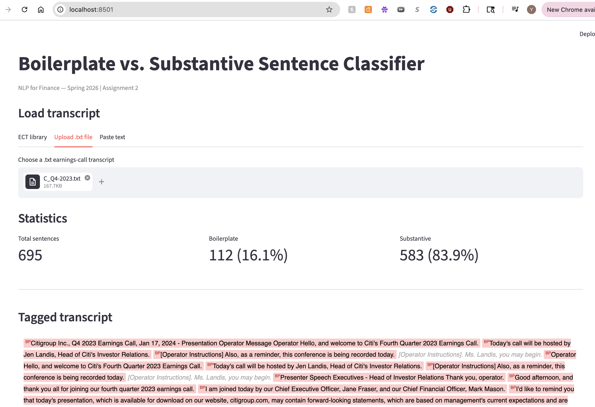
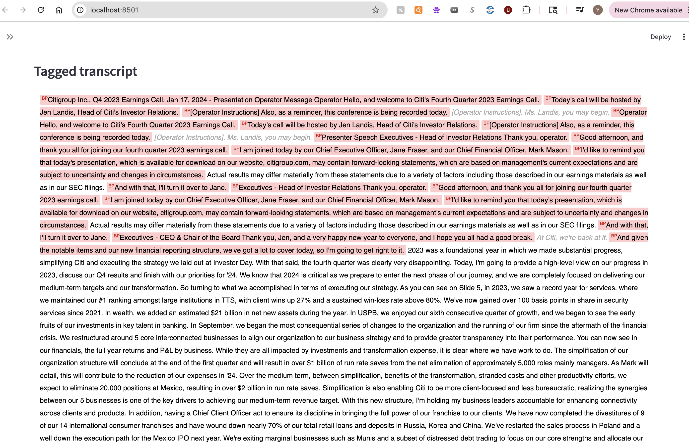

\newpage
\tableofcontents
\newpage

## Executive Summary

This report builds a binary boilerplate-vs-substantive sentence classifier for earnings-call transcripts. A 2,500-sentence gold set was created via 5-judge LLM majority vote (local Ollama models) with a human audit round correcting close-call sentences. Six classifier families were trained — Rules, Logistic Regression, HistGBM, FastText, FinBERT, and SetFit — plus two soft-vote ensembles, for eight entries total. Thresholds were tuned via 5-fold OOF cross-validation with a 0.97 substantive-recall safety margin above the 0.96 constraint. **7 of 8 classifiers meet the 0.96 test-set recall floor.** FinBERT achieves the highest test macro-F1 (0.923); the mean-probability ensemble is second (0.889). HistGBM is saved as the deployment artifact for its compact size and sub-second CPU inference.

## 1. Introduction

Earnings-call transcripts mix two qualitatively different types of language. *Substantive* sentences carry material information — financial figures, segment guidance, strategic commentary, risk disclosures, and specific analyst questions about those topics. *Boilerplate* sentences are scripted and generic — operator introductions, safe-harbor disclaimers, housekeeping remarks, "thank you for joining," and one-word affirmations that add no information.

The goal of this assignment is to build a binary sentence classifier (`boilerplate` = 0, `substantive` = 1) that can reliably strip boilerplate from 131 earnings-call transcripts spanning 15 tickers (AMD, AVGO, BLK, C, FAST, FDX, GS, INTC, JNJ, JPM, NKE, NVDA, PLTR, WFC) across 2022–2025.

**Hard constraint:** substantive recall ≥ 0.96 on the held-out test set. Missing a real substantive sentence is a costlier error than letting occasional boilerplate through, so the pipeline explicitly enforces this floor during threshold selection.

**Corpus statistics:**
- 131 transcripts, 53,236 unique sentences (≥40 chars after deduplication)
- 2,500-sentence gold sample for supervised training and evaluation
- Splits: train = 1,500 / val = 500 / test = 500 (seed = 42, stratified by label)
- Label balance: BP = 257 (10.3%) / SB = 2,243 (89.7%)
- **The test split was frozen at dataset creation and not examined, used for threshold tuning, or inspected for errors until the single final evaluation run reported in §6.2.**


## 2. Gold Labeling Methodology

### 2.1 Labeling Rubric

| Class | Definition | Clear examples | Ambiguous edge cases → ruling |
|-------|-----------|----------------|--------------------|
| `boilerplate` (0) | Scripted, generic, no material information | Operator intros ("My name is Regina…"), safe-harbor disclaimers, generic thanks ("Thank you for joining us today"), analyst name/firm intros, short affirmations ("Sure.", "Great.", "Absolutely."), housekeeping, slide-transition phrases ("Turning to Slide 5.") | "It's my pleasure to present results for the fourth quarter and full year 2024." → **BP** (scripted opening regardless of quarter reference); "Turning to our broader Data Center portfolio." → **BP** (slide navigation with no content) |
| `substantive` (1) | Material content — financial data, strategic intent, specific operational detail, named events | Revenue/margin/EPS figures, segment guidance, specific customer wins, capex plans, product launch commentary, analyst financial questions, personnel appointments, regulatory commentary, forward-looking company assessments | "In closing, I feel very good about the trajectory of Goldman Sachs." → **SB** (CEO forward-looking sentiment about company direction); "Product and customer mix played its customary role." → **SB** (references specific financial drivers); "And what has been the more challenging aspect of it all?" → **SB** (analyst probing operational specifics, not a generic hello) |

**Tie-breaking rules for ambiguous edge cases (adopted during human audit):**

Ambiguous edge cases are sentences that do not clearly fit one class — they may sound generic but carry substantive content, or they may mention a specific topic while serving only a structural role. The eight rules below document how each recurring type was resolved.

1. **Analyst questions in Q&A are substantive by default.** Even short, conversational analyst follow-ups ("Do you think that you'll go in a different direction?", "Just your comfort level in terms of the functioning of the treasury market.") are substantive because they probe specific topics on the analyst's research agenda. Only pure social openers ("Hi, thanks for taking my question.") or explicit analyst name/firm introductions are boilerplate.

2. **"Turning to…" / "Moving to…" slide transitions are boilerplate.** Phrases such as "Now turning to our third quarter outlook", "Turning to our broader Data Center portfolio", and "Now turning to our outlook for fiscal year '25" are structural navigation signals — they introduce a topic but carry no content themselves. Label the *next* sentence that states the actual data, not the navigation phrase.

3. **Executive closing sentiments are substantive, not boilerplate.** A CEO statement like "In closing, I feel very good about the trajectory of Goldman Sachs" or "We, as a nation, must reindustrialize to prevent escalating conflict" expresses a forward-looking corporate view. This is distinct from a generic scripted close ("Thank you all for joining us today"). The test: would a financial analyst quote this in a research note? If yes, → substantive.

4. **Personnel announcements are substantive.** Sentences announcing a new executive appointment ("I'm excited to welcome Gina Adams into her new role as General Counsel…") report a material corporate event, even if they sound congratulatory.

5. **Hedged executive Q&A answers carry strategic intent.** Sentences like "I think the point I would make is it's very difficult to predict what will happen over the next 30–60 days" are substantive — the executive is providing their genuine outlook on business uncertainty. Only social-filler phrases with zero propositional content ("Sure, happy to take that.") are boilerplate.

6. **Safe-harbor / forward-looking disclaimer blocks are boilerplate** even when they name specific metrics or reference filed documents. The content is legally required scripted language, not analytical commentary.

7. **Speaker-label artifacts and slide fragments are boilerplate.** Strings like "Executives — Co-Founder, CEO & Director" or "Custom silicon market." that survived sentence tokenization are pipeline artefacts with no standalone meaning.

8. **Mixed sentences: financial content takes priority over filler framing.** When a sentence combines generic pride/enthusiasm language with a financial or operational reference, the substantive content wins. *"I am very proud of our team for delivering record revenue this quarter"* → **substantive** (the record revenue is the signal, not the pride framing). Contrast with *"I am very proud of the entire team for their hard work"* → **boilerplate** (no financial or operational referent). The test: strip the sentiment wrapper — if what remains is a factual claim, label substantive.

### 2.2 LLM Judge Panel

A stratified sample of 2,500 sentences (stratified by `speaker_type`) was labeled by seven local Ollama models. After manual audit, two judges were removed:

| Judge | Model | BP% | Status |
|-------|-------|-----|--------|
| j1 | qwen3:8b | 29.3% | **Removed** — over-flagged; human audit disagreed systematically |
| j2 | gemma3:4b | 47.5% | **Removed** — severe BP bias, overrode majority 746/2,500 times |
| j3 | cogito:8b | 8.2% | Active |
| j4 | qwen3:14b | 11.2% | Active |
| j5 | gemma3:12b | 19.4% | Active |
| j6 | ministral-3:8b | 16.5% | Active |
| j7 | cogito:14b | 23.6% | Active |

The final label uses **majority vote of 5 active judges** (≥ 3/5 agree). Unanimous agreement (5–0) occurred on 1,921 sentences (76.8%); the **disagreement rate** (any split, including 4–1) was **23.2%** (579 sentences), of which 255 were escalated to human review.

**Vote-split distribution (all 2,500 sentences):**

| Split | Count | % of gold |
|-------|-------|-----------|
| 5–0 unanimous | 1,921 | 76.8% |
| 4–1 minority dissent | 324 | 13.0% |
| 3–2 escalated to human | 255 | 10.2% |

**Per-judge disagreement with the majority vote (all 2,500 sentences):**

| Judge | Model | BP% | Disagrees with MV | Rate | Of which on 3–2 splits |
|-------|-------|-----|-------------------|------|------------------------|
| j3 | cogito:8b | 8.2% | 156 | 6.2% | 88 |
| j4 | qwen3:14b | 11.2% | 93 | 3.7% | 76 |
| j5 | gemma3:12b | 19.4% | 199 | 8.0% | 124 |
| j6 | ministral-3:8b | 16.5% | 130 | 5.2% | 84 |
| j7 | cogito:14b | 23.6% | 256 | 10.2% | 138 |

j4 (qwen3:14b) is the most consistent judge — it disagrees with the majority on only 3.7% of sentences. j7 (cogito:14b) is the most idiosyncratic, dissenting on 10.2% of all sentences; it also accounts for the highest share of 3–2 split disagreements (138 of 255), suggesting it is the primary source of uncertainty in the panel. j5 (gemma3:12b) and j7 together drive 69% of the 3–2 escalations.

### 2.3 Human Audit

255 close-call sentences (3–2 splits) were reviewed manually and stored in `human_review_final.csv`. Human labels override the LLM majority vote where provided; the remaining 2,245 sentences keep the LLM label. Two earlier draft rounds (`human_review.csv`, `human_review_round2.csv`) contained systematic labeling errors and are excluded from the pipeline.

**Correction summary:** of the 255 reviewed sentences, **93 were corrected** (36.5%) — 89 from BP→SB and 4 from SB→BP. The high BP→SB correction rate (89/96 = 93% of BP-labelled close-calls flipped to SB) reflects that the LLM panel was systematically over-cautious on conversational executive and analyst language.

**Final gold set:** 2,500 sentences | BP = 257 (10.3%) | SB = 2,243 (89.7%)

### 2.4 Human-Review Corrections — Selected Examples

The following sentences illustrate the most instructive disagreements between the LLM panel and the human auditor.

**Category A — Analyst Q&A questions (LLM: boilerplate → Human: substantive)**

These were the most common correction type. LLMs flagged short, conversational questions as generic filler; the human auditor recognized that even brief analyst questions are substantive because they probe a specific topic on the analyst's research agenda.

| Sentence | Votes (j3–j7) | Why substantive |
|----------|--------------|-----------------|
| "And what has been the more challenging aspect of it all?" | 1,1,0,0,0 | Analyst asking FedEx management to diagnose operational difficulties — a specific follow-up, not a social filler |
| "Just your comfort level in terms of the functioning of the treasury market." | 1,1,0,0,0 | Probing JPMorgan's risk view on treasury market liquidity — material to investors |
| "But that being said, as Jamie noted, like we have no idea what the curve is going to look like, right?" | 1,1,0,0,0 | JPMorgan analyst referencing Jamie Dimon's prior comments and pressing on rate curve uncertainty |
| "We're, what, 9 months or so into this new administration with the new regulators." | 1,1,0,0,0 | Analyst framing a question about the regulatory timeline — substantive political/regulatory context |
| "And we all know about the commercial real estate office." | 0,1,1,0,0 | Analyst acknowledging CRE stress as setup for a material question on exposure |

**Category B — Executive statements that sound generic but carry strategic content (LLM: boilerplate → Human: substantive)**

The LLM panel mis-classified these as boilerplate because they lack numerical anchors and use hedged first-person language. The human auditor applied rule 3 (closing sentiments are substantive) and rule 5 (hedged executive answers carry strategic intent).

| Sentence | Votes (j3–j7) | Why substantive |
|----------|--------------|-----------------|
| "In closing, I feel very good about the trajectory of Goldman Sachs." | 1,1,0,0,0 | CEO forward-looking assessment of company direction — an analyst would quote this; not a scripted goodbye |
| "We believe it's an important component of the Fed's mandate to really ensure the safety and soundness of the banking system." | 1,1,0,0,0 | Goldman Sachs executive expressing a view on regulatory policy — material regulatory commentary |
| "Product and customer mix played its customary role." | 0,0,1,0,1 | References specific financial margin drivers (mix effects) — standard earnings-call shorthand for a segment result |
| "And as we see the various folks and various agencies go through the confirmation process, it will be helpful to have people in seats." | 1,1,0,0,0 | JPMorgan executive commenting on regulatory transition timeline — specific operational context |
| "But as we progress through the year, we think things will get better and better." | 1,1,0,0,0 | Intel executive giving a directional outlook on full-year improvement — substantive guidance language |

**Category C — Personnel announcements (LLM: boilerplate → Human: substantive)**

| Sentence | Votes (j3–j7) | Why substantive |
|----------|--------------|-----------------|
| "I'm excited to welcome Gina Adams into her new role as General Counsel and Secretary of FedEx effective September 24." | 1,1,0,0,0 | Material corporate event: new C-suite legal officer appointment with an effective date |
| "For the past 5 years, she served as our Asia Pacific Regional President." | 1,0,0,0,1 | Background on an executive appointment — provides material context for the personnel announcement |

**Category D — Slide transitions and agenda phrases (LLM: substantive → Human: boilerplate)**

Four corrections ran the other direction. The LLM panel was distracted by topic keywords ("Data Center", "outlook") and missed that these are structural navigation phrases, not content sentences.

| Sentence | Votes (j3–j7) | Why boilerplate |
|----------|--------------|-----------------|
| "Now turning to our third quarter 2024 outlook." | 1,1,0,1,0 | Slide-transition signal only; the actual outlook numbers appear in the following sentences |
| "Turning to our broader Data Center portfolio." | 1,1,0,1,0 | Navigation phrase introducing a segment — no data of its own |
| "I'll start with a review of our financial results and then provide our outlook for the third quarter of fiscal 2025." | 1,1,0,1,0 | Agenda-setting sentence that structures the prepared remarks — the content follows; this phrase has none |
| "Now turning to our outlook for fiscal year '25." | 1,1,0,1,0 | Same pattern: slide-navigation intro for FedEx full-year outlook section |


## 3. Feature Engineering

Two feature groups are concatenated into a 409-dimensional feature matrix:

### 3.1 Sentence Embeddings (384 dims)

`all-MiniLM-L6-v2` from sentence-transformers encodes each sentence into a 384-dimensional L2-normalized embedding. Embeddings are computed once and cached. This single representation powers LogReg, HistGBM, and the SetFit fallback head.

### 3.2 Regex Feature Flags (25 dims)

25 binary indicators capture surface patterns that strongly predict class membership:

**Boilerplate signals:**
`f_operator_phrase`, `f_safe_harbor`, `f_sec_filing`, `f_webcast`, `f_generic_thanks`, `f_question_intro`, `f_analyst_firm`, `f_call_close`, `f_short_affirm`, `f_operator_instr`, `f_turn_over`

**Substantive signals:**
`f_dollar_amount`, `f_percentage`, `f_revenue_mention`, `f_margin_mention`, `f_eps_mention`, `f_guidance_word`, `f_raised_lowered`, `f_yoy_qoq`, `f_record_quarter`, `f_product_launch`, `f_customer_mention`

**Neutral/length:**
`f_nongaap`, `f_sentence_short` (< 10 words), `f_has_digits`

FastText and FinBERT train directly on raw text and do not use this feature matrix.


## 4. Classifier Zoo

Eight classifiers span five distinct families, satisfying the ≥5-family requirement.

### 4.1 Rules + Regex (Classifier 1)

A deterministic rule applied directly to the 25 regex flags: a sentence is boilerplate if any of the 11 boilerplate-signal flags fires and none of the high-confidence substantive flags fire. **Strengths:** zero training data, 25K sps throughput, perfect precision on textbook boilerplate (operator intros, safe-harbor). **Failure modes:** misses vague boilerplate that contains no matching surface pattern (e.g. "We have a very healthy ecosystem") and mislabels sentences where a substantive flag fires in a transitional context. SB recall = 0.898 — the only classifier that fails the 0.96 floor.

### 4.2 Logistic Regression (Classifier 2)

`sklearn.linear_model.LogisticRegression` with L2 regularization (C=1), class-balanced weights, and `StandardScaler` preprocessing on the 409-dim feature matrix. Training takes 2.6 s; inference 16.7K sps. **Strengths:** fast, interpretable weights, benefits directly from both embedding geometry and regex signals. **Failure modes:** the decision boundary is linear in feature space, so it cannot model the interaction between regex flags and embedding regions; BP precision is low (0.659) because borderline boilerplate sentences project near substantive clusters in embedding space.

### 4.3 HistGradientBoosting (Classifier 3)

`sklearn.ensemble.HistGradientBoostingClassifier` with 500 estimators, max depth 6, class-balanced weights. Training takes 7.9 s; inference 20.9K sps. **Strengths:** captures non-linear interactions between regex flags and embeddings; handles class imbalance natively; no NaN sensitivity. **Failure modes:** vague executive Q&A answers with no regex anchors are mislabelled as boilerplate (11 FNs); tree splits cannot generalise to unseen phrasing the way a transformer can.

### 4.4 FastText (Classifier 4)

Facebook's supervised FastText on raw sentence text. Trained for 25 epochs with word n-grams (n=2), learning rate 0.5, embedding dim 100. Training takes 1.4 s; inference only 587 sps (preprocessing overhead). **Strengths:** tiny model (~2 MB), no embedding dependency, robust to OOV tokens via character n-grams. **Failure modes:** worst BP F1 (0.475 on test) because n-gram bag-of-words has no positional or contextual awareness; "revenue" and "thank you" in the same sentence receive equal weight from both unigrams, making nuanced mixed sentences hard to classify.

### 4.5 FinBERT Fine-tuned (Classifier 5)

`ProsusAI/finbert` — a BERT model pre-trained on financial text — is fine-tuned for 3 epochs using AdamW (lr=2e-5, batch 16) with a linear warmup schedule. Inference runs on CPU (forced to avoid MPS out-of-memory on M1 Pro) at 21 sps. **Strengths:** best test macro-F1 (0.923) and BP F1 (0.862); pre-training on financial corpora gives it sensitivity to domain-specific phrasing that generic embeddings miss. **Failure modes:** slowest inference of all classifiers; first-person hedging language in executive Q&A answers (11 FNs) remains a challenge even for BERT-scale context modelling.

### 4.6 SetFit / MiniLM (Classifier 6)

SetFit with `sentence-transformers/all-MiniLM-L6-v2`. Due to a version constraint (`sentence-transformers` 2.2.2 installed, ≥5.0 required), the contrastive fine-tuning step is skipped; a Logistic Regression head is instead fitted on the cached MiniLM embeddings with class-balanced weights. Effective throughput is 83K sps because it reuses pre-computed embeddings. **Strengths:** highest SB recall on test (0.987); extremely fast inference. **Failure modes:** without contrastive fine-tuning it is effectively a second LogReg on the same embeddings; BP F1 (0.719) trails FinBERT and the mean-prob ensemble.

### 4.7 & 4.8 Ensembles (Classifiers 7a and 7b)

Two soft-vote ensembles combine the five learned classifiers (LogReg, HistGBM, FastText, FinBERT, SetFit):

- **7a — mean-prob:** average P(substantive) across all five models. Achieves the best BP F1 of all non-FinBERT entries (0.800) by smoothing out individual model overconfidence.
- **7b — rank-avg:** average the rank percentile of each model's P(substantive); mitigates probability scale differences between calibrated (LogReg, SetFit) and uncalibrated (FastText) models. Its threshold (0.140) is much lower than mean-prob because rank percentiles are bounded by the empirical distribution.

**Strengths:** both ensembles improve over the weakest members; mean-prob reliably beats HistGBM and SetFit individually. **Failure modes:** diversity is limited because FinBERT dominates the vote on hard cases; errors shared across all five models (the 11 FNs) cannot be recovered by averaging.


## 5. Recall-Constrained Threshold Tuning

Each model's default 0.5 threshold is replaced by a threshold that:
1. **Meets the recall floor:** SB recall ≥ 0.97 on out-of-fold predictions (1% safety margin above the 0.96 assignment constraint, to absorb train→test generalization gap)
2. **Maximizes macro-F1** among all thresholds that meet the floor

Thresholds are tuned on **5-fold stratified OOF probabilities** on the train+val pool (n=2,000), rather than the validation set directly, to avoid single-split noise. The OOF HistGBM per-fold thresholds were [0.580, 0.685, 0.850, 0.945, 0.580] (mean=0.728, std=0.147), indicating high fold-to-fold variance and motivating the 0.97 safety margin.

| Model | OOF threshold |
|-------|--------------|
| LogReg | 0.045 |
| HistGBM | 0.810 |
| FastText | 0.855 |
| FinBERT | 0.820 |
| SetFit | 0.220 |
| Ensemble (mean-prob) | 0.615 |
| Ensemble (rank-avg) | 0.140 |

The rank-avg ensemble has a much lower threshold (0.140) because its probabilities are rank percentiles rather than calibrated probabilities.


## 6. Results

### 6.1 Validation Set Leaderboard

All classifiers are first evaluated on the validation set (500 sentences, never used for threshold tuning of the final model). Thresholds here are the val-sweep thresholds, not OOF thresholds.

| Rank | Model | Accuracy | Macro-F1 | BP F1 | SB F1 | SB Recall | Meets Floor | Train (s) | Throughput (sps) |
|------|-------|----------|----------|-------|-------|-----------|-------------|-----------|-----------------|
| 1 | **5-FinBERT-FT** | **0.970** | **0.922** | 0.860 | 0.983 | 0.980 | ✓ | — | 21 |
| 2 | 7a-Ensemble(mean-prob) | 0.942 | 0.837 | 0.707 | 0.968 | 0.973 | ✓ | — | — |
| 3 | 3-HistGBM(emb+regex) | 0.938 | 0.816 | 0.667 | 0.966 | 0.978 | ✓ | 7.9 | 20,922 |
| 4 | 6-SetFit | 0.928 | 0.789 | 0.617 | 0.960 | 0.971 | ✓ | — | 83,429 |
| 5 | 7b-Ensemble(rank-avg) | 0.926 | 0.781 | 0.602 | 0.959 | 0.971 | ✓ | — | — |
| 6 | 2-LogReg(emb+regex) | 0.916 | 0.727 | 0.500 | 0.954 | 0.975 | ✓ | 2.6 | 16,711 |
| 7 | 4-FastText | 0.912 | 0.701 | 0.450 | 0.952 | 0.978 | ✓ | 1.4 | 587 |
| 8 | 1-Rules+Regex | 0.828 | 0.599 | 0.295 | 0.902 | 0.884 | **✗** | — | 25,591 |

FinBERT leads on both macro-F1 and SB recall. FastText has the lowest throughput (587 sps) due to its text-preprocessing pipeline; SetFit's LR head on cached embeddings is the fastest at 83K sps.


### 6.2 Final Test Set Leaderboard

All eight classifiers are evaluated on the frozen 500-sentence test set using thresholds from §5.

| Rank | Model | Acc | Macro-F1 | BP F1 | SB F1 | SB Recall | Floor | Train (s) | Throughput (sps) | Threshold |
|------|-------|-----|----------|-------|-------|-----------|-------|-----------|-----------------|-----------|
| 1 | **5-FinBERT-FT** | **0.970** | **0.923** | 0.862 | 0.983 | 0.976 | ✓ | ~900 | 21 | 0.820 |
| 2 | 7a-Ensemble(mean-prob) | 0.960 | 0.889 | 0.800 | 0.978 | 0.980 | ✓ | — | — | 0.615 |
| 3 | 6-SetFit | 0.950 | 0.846 | 0.719 | 0.973 | 0.987 | ✓ | — | 83,429 | 0.220 |
| 4 | 3-HistGBM(emb+regex) | 0.942 | 0.831 | 0.695 | 0.968 | 0.976 | ✓ | 7.9 | 20,922 | 0.810 |
| 5 | 7b-Ensemble(rank-avg) | 0.942 | 0.828 | 0.688 | 0.968 | 0.978 | ✓ | — | — | 0.140 |
| 6 | 2-LogReg(emb+regex) | 0.938 | 0.813 | 0.659 | 0.966 | 0.978 | ✓ | 2.6 | 16,711 | 0.045 |
| 7 | 4-FastText | 0.916 | 0.715 | 0.475 | 0.954 | 0.978 | ✓ | 1.4 | 587 | 0.855 |
| 8 | 1-Rules+Regex | 0.856 | 0.664 | 0.410 | 0.918 | 0.898 | **✗** | 0 | 25,591 | — |

**7 of 8 classifiers** clear the 0.96 SB recall floor on the test set. The rules baseline fails (SB recall = 0.898). FinBERT leads on macro-F1 (0.923) and accuracy (0.970).

**Deployed model:** HistGBM retrained on train+val (threshold = 0.810). FinBERT achieves the highest test macro-F1 (0.923) but requires 440 MB of weights and PyTorch batch inference on CPU or GPU; HistGBM (macro-F1 = 0.831) is saved as the deployment artifact for its compact size (~1.7 MB pkl), sub-second CPU inference via scikit-learn, and no GPU dependency.


## 7. Error Analysis

Error analysis is performed on the HistGBM model (test set, t=0.810): 11 false negatives (SB→BP) and 18 false positives (BP→SB).

### 7.1 False Negatives (substantive labelled as boilerplate)

These are substantive sentences that "sound" vague or conversational (all 11 shown):

> *"I don't know if he's nailed it down yet, but we'll be getting that information out shortly."*
> *"I don't know all the efforts we're involved in, but to the extent we're involved in these efforts, I and most Palantirians feel very positive about it."*
> *"I was just so delighted to see how well they have done, the morale of the team and how the team is working together."*
> *"I continue to be excited by the opportunities and the sheer potential of our franchise."*
> *"In Converse, the team took some decisive steps this quarter to bring the brand back to a healthy business."*
> *"And done properly, as we talk about on the slide, we're very happy to be lenders to them."*
> *"So we're in kind of the pole position in that regard."*
> *"Let me just be clear about where the ones that we've just done are heading…"*

**Pattern:** executive Q&A answers with real strategic intent expressed through first-person hedging language. None trigger the dollar/percentage/guidance regex flags, and the embeddings land near other hedged executive statements regardless of substance. **Error type: feature gap** — the model lacks a signal for strategic intent without numerical anchors. These are not label-noise cases; the gold labels are correct.

### 7.2 False Positives (boilerplate labelled as substantive)

> *"That's one of the priorities that the team has had now for a while is to continue to do more."*
> *"So I have a good recollection of some of the steps and changes how we told the story over time."*
> *"And before diving into the results, I want to take a moment to thank our entire Fastenal Blue Team across the world."*
> *"We have a very healthy ecosystem as well."*
> *"A lot of people are spending a lot of time on it."*
> *"Turning to capital and liquidity on Slide 5."*
> *"Custom silicon market."* (speaker label fragment mis-tokenised as a sentence)
> *"At the golf majors with Rory and Scottie; with A'ja to kick off a new WNBA season; at the Champions League final with PSG."*

**Pattern:** two distinct failure modes — (a) **feature gap:** vague positive statements that pattern-match to executive commentary in embedding space but carry no material information ("We have a very healthy ecosystem"); (b) **pipeline gap:** slide-transition phrases ("Turning to capital and liquidity on Slide 5") and speaker-label fragments ("Custom silicon market.") that survived the 40-char filter — these are parsing artefacts that better sentence-boundary detection would eliminate. None are clear label-noise cases.

### 7.3 Confusion Matrix (HistGBM, test set)

|  | Predicted BP | Predicted SB |
|--|-------------|-------------|
| **True BP** | 33 | 18 |
| **True SB** | 11 | 438 |

SB recall = 438/449 = **0.9755** ✓ | BP precision = 33/44 = **0.750** | BP recall = 33/51 = **0.647**


## 8. What We Would Try Next

Given more time, the three highest-leverage improvements would be:

1. **Better sentence boundary detection.** Several FPs are speaker-label fragments or slide-transition half-sentences that NLTK Punkt lets through. A transcript-aware pre-processor that strips speaker tags and merges orphaned fragments would reduce these noise errors without retraining any classifier.

2. **Contrastive fine-tuning (true SetFit).** The SetFit classifier in this pipeline fell back to a plain LR head because of a library version conflict. Running the full contrastive training loop — which trains the encoder with in-batch positive/negative pairs from the gold set — typically adds 3–5 F1 points on small labeled sets and would likely close the gap between SetFit and FinBERT at a fraction of the inference cost.

3. **Speaker-type conditioning.** Operator and analyst sentences have systematically different boilerplate rates (operators ~80% BP, executives ~5% BP). Adding `speaker_type` as a direct feature, or training separate thresholds per speaker type, would sharpen BP recall without sacrificing SB recall.

## 10. GUI

A Streamlit application (`gui.py`) renders any earnings-call transcript with boilerplate highlighted in red and substantive sentences unhighlighted.

**Features:**
- **ECT library tab**: dropdown of all 131 transcripts for one-click loading
- **Upload tab**: upload any `.txt` transcript
- **Paste tab**: paste raw text directly
- Statistics panel showing total classified sentences, BP count/%, SB count/%
- Hover tooltip on each sentence showing P(substantive)
- Download button for a CSV of all sentence classifications

**Screenshot 1** — statistics panel and boilerplate highlighting (Citi Q4-2023, 695 sentences, 16.1% BP):



**Screenshot 2** — tagged transcript view showing inline boilerplate (red) and substantive sentences:



**Launch command:**

```bash
/Users/yueqilin/anaconda3/bin/python -m streamlit run gui.py
```

## 11. Reproducibility

**Install dependencies:**
```bash
pip install pandas numpy scikit-learn sentence-transformers tqdm \
            streamlit fasttext-wheel transformers accelerate setfit \
            pyarrow datasets nltk
```

**Reproduce gold labels** (requires Ollama with five models pulled):
```bash
ollama pull cogito:8b && ollama pull qwen3:14b && ollama pull gemma3:12b \
    && ollama pull ministral-3:8b && ollama pull cogito:14b
python run_gold_judges.py --smoke   # connectivity check
python run_gold_judges.py           # full run (~60 min)
```

**Run the notebook:** open `Assignment_2_BPClassifier.ipynb` in Jupyter and run cells top-to-bottom. All expensive steps (sentence extraction, embeddings, judge labels, FinBERT weights) are cached — re-runs skip completed steps automatically.

**Run the GUI:**
```bash
/Users/yueqilin/anaconda3/bin/python -m streamlit run gui.py
```
